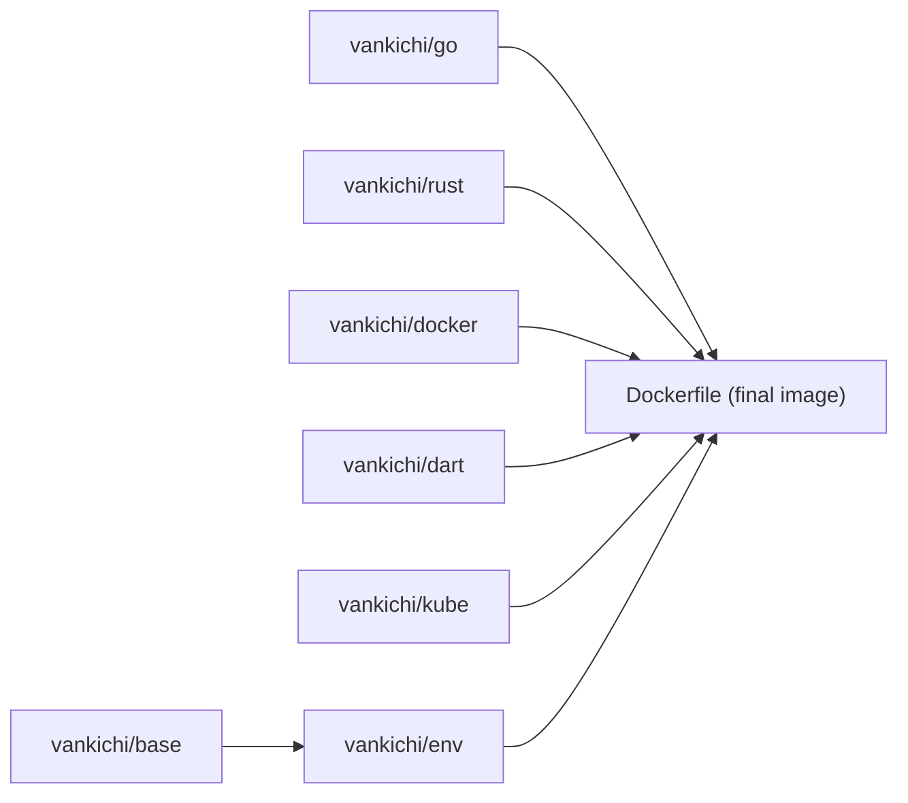

# vankichi/dotfiles

[日本語](README.md) | **English**


vankichi's personal development environment: dotfiles, a Docker-based dev container, and Claude Code configuration, all managed in a single repository.

> This file is a translated mirror. The Japanese `README.md` is the source of truth for this repository.

## Overview

This repository serves three purposes:

1. **Dotfiles** — zsh / tmux / git / neovim / starship / sheldon configs, symlinked into `$HOME`
2. **Dev Container** — a multi-stage Docker dev container bundling Go / Rust / Dart / Kubernetes tooling
3. **Claude Code configuration** — agents / skills / hooks / rules used with Claude Code in this environment

## Architecture

Docker images are built in multiple stages (base → env → final image); each language layer is pushed as its own image to the `vankichi/` namespace on Docker Hub.



## Contents

### Dotfiles

`zshrc` / `tmux.conf` / `gitconfig` / `gitignore` / `gitattributes` / `editorconfig` / `starship.toml` / `config/nvim` (Lua, lazy.nvim) / `config/sheldon` are symlinked into `$HOME` (and XDG paths) via `make new_link`.

### Dev Container

`dockers/*.Dockerfile` builds separate layer images for base / env / go / rust / dart / k8s / docker / gcloud / glibc / nim. The root `Dockerfile` combines them via multi-stage build into the final dev container image. `docker buildx` provides multiplatform builds for `linux/amd64,linux/arm64`.

### Claude Code configuration

`claude/` holds agents / skills / hooks / rules / statusline. The Japanese docs under `claude/ja/` are the source of truth; the English versions are translated from them.

## Quick Start

```bash
# Symlink dotfiles
make new_link
# Remove symlinks
make new_clean

# Build and run the dev container
make build
source ./alias && devrun
devin        # exec into the container
devkill      # stop and remove the container
devres       # devkill && devrun

# Multiplatform build
make init_buildx
make create_buildx
make prod_build
```

## Docker Image Hierarchy

| Image | Dockerfile | Purpose |
|---|---|---|
| `vankichi/base` | `dockers/base.Dockerfile` | Base OS and common tools |
| `vankichi/env` | `dockers/env.Dockerfile` | Environment-dependent libraries (NGT, TensorFlow C, etc.) |
| `vankichi/go` | `dockers/go.Dockerfile` | Go toolchain |
| `vankichi/rust` | `dockers/rust.Dockerfile` | Rust toolchain |
| `vankichi/dart` | `dockers/dart.Dockerfile` | Dart / Flutter |
| `vankichi/kube` (k8s) | `dockers/k8s.Dockerfile` | Kubernetes tooling |
| `vankichi/docker` | `dockers/docker.Dockerfile` | Docker CLI / buildx |
| — | `dockers/gcloud.Dockerfile` | gcloud CLI |
| — | `dockers/glibc.Dockerfile` | glibc compatibility layer |
| — | `dockers/nim.Dockerfile` | Nim toolchain |
| Final image | `Dockerfile` | The dev container assembled from the layers above |

## Make Targets

| Category | Target | Description |
|---|---|---|
| symlink | `new_link` / `new_clean` | Create / remove dotfile symlinks |
| build | `build` / `prod_build` / `build_all` | Build the final image (simple / multiplatform buildx / all layers) |
| build (layers) | `build_base` / `build_env` / `build_go` / `build_rust` / `build_dart` / `build_k8s` / `build_docker` / `build_gcloud` / `build_glibc` / `build_nim` | Build each layer image individually |
| push | `push` / `push_all` / `push_base` / `push_env` / `push_go` / `push_rust` / `push_dart` / `push_k8s` / `push_docker` / `push_gcloud` / `push_glibc` / `push_nim` | Push each image to Docker Hub |
| buildx | `init_buildx` / `create_buildx` / `remove_buildx` | Register qemu binfmt / create / remove the buildx builder |
| version | `version/go` / `version/ngt` / `version/tensorflow` / `version/flutter` / `version/all` | Update `versions/*` from upstream releases |
| run | `run` / `pull` / `login` | Run the container / pull images / Docker Hub login |

## Versions

Files under `versions/` are consumed as `--build-arg` in the Docker builds, and `make version/*` keeps them in sync with upstream releases.

| File | Content |
|---|---|
| `versions/GO_VERSION` | Go version |
| `versions/NGT_VERSION` | NGT version |
| `versions/TENSORFLOW_C_VERSION` | TensorFlow C library version |
| `versions/FLUTTER_VERSION` | Flutter version |

## Repository Structure

```
.
├── Dockerfile            # Final image (multi-stage build)
├── Makefile / Makefile.d # Build / symlink / version-update tasks
├── alias                 # Shell functions: devrun / devin / devkill / devres, etc.
├── dockers/              # Per-layer Dockerfiles
├── versions/             # Version files used as build args
├── config/
│   ├── nvim/             # Neovim config (Lua, lazy.nvim)
│   └── sheldon/          # zsh plugin manager (sheldon)
├── claude/                # Claude Code configuration (agents / skills / hooks / rules)
├── garuda/                # Garuda Linux setup scripts
└── zshrc, tmux.conf, gitconfig, starship.toml, ... # assorted dotfiles
```

## License

[MIT License](LICENSE) © 2020 Kiichiro YUKAWA
