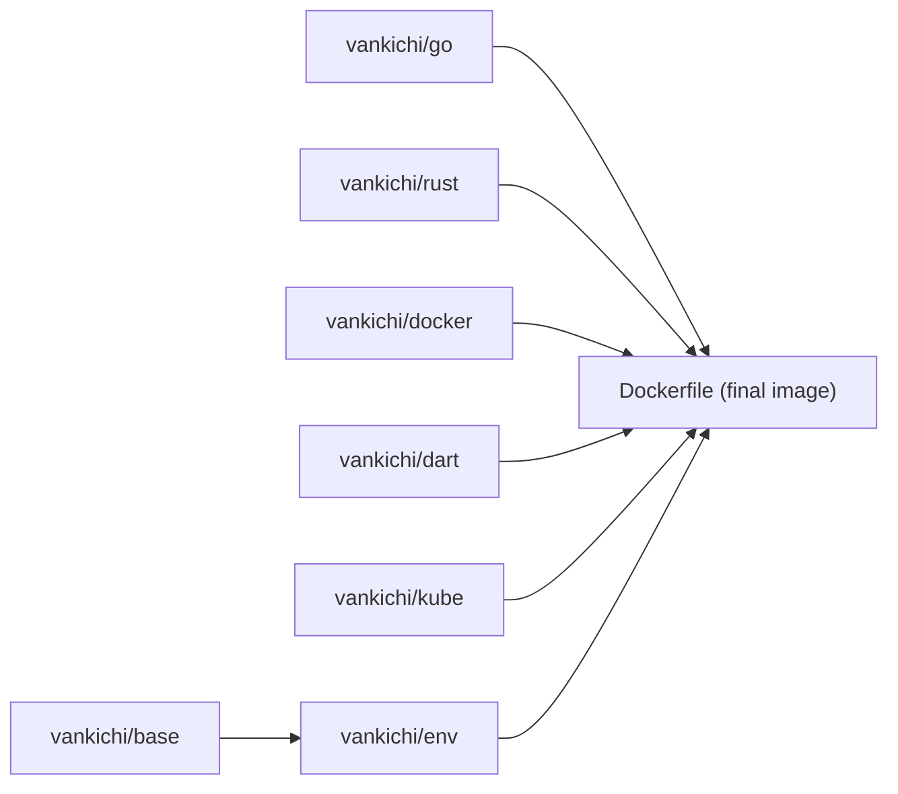

# vankichi/dotfiles

**日本語** | [English](README.en.md)


dotfiles・Docker ベースの開発コンテナ・Claude Code 設定をひとつの repo で管理する、vankichi の個人開発環境一式です。

## Overview

このリポジトリは 3 つの役割を持ちます。

1. **Dotfiles** — zsh / tmux / git / neovim / starship / sheldon などの設定を symlink で `$HOME` に配置
2. **Dev Container** — Go / Rust / Dart / Kubernetes ツール一式を積んだ多段ビルドの Docker 開発コンテナを構築・配布
3. **Claude Code 設定** — agents / skills / hooks / rules など、この開発環境で使う Claude Code の設定一式

## Architecture

Docker イメージは base → env → 最終イメージの多段ビルドで構成され、各言語レイヤは個別イメージとして Docker Hub の `vankichi/` namespace に push されます。



## Contents

### Dotfiles

`zshrc` / `tmux.conf` / `gitconfig` / `gitignore` / `gitattributes` / `editorconfig` / `starship.toml` / `config/nvim` (Lua, lazy.nvim) / `config/sheldon` を `make new_link` で `$HOME` (および XDG パス) に symlink します。

### Dev Container

`dockers/*.Dockerfile` で base / env / go / rust / dart / k8s / docker / gcloud / glibc / nim の各レイヤイメージを個別に構築し、ルートの `Dockerfile` がそれらをマルチステージで組み合わせて最終的な開発コンテナイメージを作ります。`docker buildx` により `linux/amd64,linux/arm64` のマルチプラットフォームビルドに対応しています。

### Claude Code 設定

`claude/` 配下に agents / skills / hooks / rules / statusline を配置。日本語版は `claude/ja/` が source of truth で、英語版はそこから反映されます。

## Quick Start

```bash
# dotfiles を symlink
make new_link
# symlink を解除
make new_clean

# 開発コンテナをビルドして起動
make build
source ./alias && devrun
devin        # コンテナに exec
devkill      # コンテナを停止・削除
devres       # devkill && devrun

# マルチプラットフォームビルド
make init_buildx
make create_buildx
make prod_build
```

## Docker Image Hierarchy

| イメージ | Dockerfile | 役割 |
|---|---|---|
| `vankichi/base` | `dockers/base.Dockerfile` | ベース OS・共通ツール |
| `vankichi/env` | `dockers/env.Dockerfile` | NGT / TensorFlow C など環境依存ライブラリ |
| `vankichi/go` | `dockers/go.Dockerfile` | Go ツールチェーン |
| `vankichi/rust` | `dockers/rust.Dockerfile` | Rust ツールチェーン |
| `vankichi/dart` | `dockers/dart.Dockerfile` | Dart / Flutter |
| `vankichi/kube` (k8s) | `dockers/k8s.Dockerfile` | Kubernetes 関連ツール |
| `vankichi/docker` | `dockers/docker.Dockerfile` | Docker CLI / buildx |
| — | `dockers/gcloud.Dockerfile` | gcloud CLI |
| — | `dockers/glibc.Dockerfile` | glibc 互換レイヤ |
| — | `dockers/nim.Dockerfile` | Nim ツールチェーン |
| 最終イメージ | `Dockerfile` | 上記レイヤを集約した開発コンテナ本体 |

## Make Targets

| カテゴリ | target | 説明 |
|---|---|---|
| symlink | `new_link` / `new_clean` | dotfiles の symlink 作成・解除 |
| build | `build` / `prod_build` / `build_all` | 最終イメージのビルド (単純 / multiplatform buildx / 全レイヤ込み) |
| build (レイヤ) | `build_base` / `build_env` / `build_go` / `build_rust` / `build_dart` / `build_k8s` / `build_docker` / `build_gcloud` / `build_glibc` / `build_nim` | 各レイヤイメージの個別ビルド |
| push | `push` / `push_all` / `push_base` / `push_env` / `push_go` / `push_rust` / `push_dart` / `push_k8s` / `push_docker` / `push_gcloud` / `push_glibc` / `push_nim` | 各イメージの Docker Hub push |
| buildx | `init_buildx` / `create_buildx` / `remove_buildx` | qemu binfmt 登録・buildx builder の作成/削除 |
| version | `version/go` / `version/ngt` / `version/tensorflow` / `version/flutter` / `version/all` | upstream リリースから `versions/*` を更新 |
| run | `run` / `pull` / `login` | コンテナ起動 / イメージ pull / Docker Hub login |

## Versions

`versions/` 配下のファイルが各 Docker build の `--build-arg` として使われ、`make version/*` で upstream の最新リリースに追従します。

| ファイル | 内容 |
|---|---|
| `versions/GO_VERSION` | Go のバージョン |
| `versions/NGT_VERSION` | NGT のバージョン |
| `versions/TENSORFLOW_C_VERSION` | TensorFlow C library のバージョン |
| `versions/FLUTTER_VERSION` | Flutter のバージョン |

## Repository Structure

```
.
├── Dockerfile            # 最終イメージ (多段ビルド)
├── Makefile / Makefile.d # ビルド・symlink・version 更新タスク
├── alias                 # devrun / devin / devkill / devres などのシェル関数
├── dockers/              # レイヤ別 Dockerfile
├── versions/             # 各種バージョンファイル (build-arg 用)
├── config/
│   ├── nvim/             # Neovim 設定 (Lua, lazy.nvim)
│   └── sheldon/          # zsh プラグイン管理 (sheldon)
├── claude/                # Claude Code 設定 (agents / skills / hooks / rules)
├── garuda/                # Garuda Linux 向けセットアップスクリプト
└── zshrc, tmux.conf, gitconfig, starship.toml, ... # 各種 dotfiles
```

## License

[MIT License](LICENSE) © 2020 Kiichiro YUKAWA
