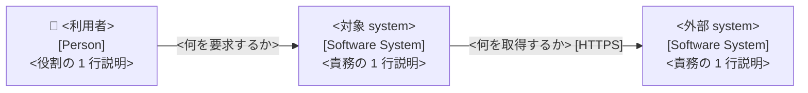
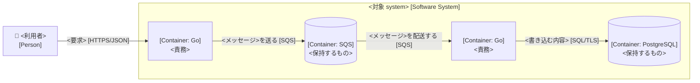
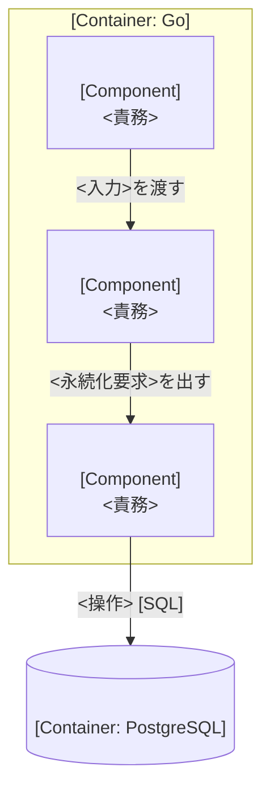
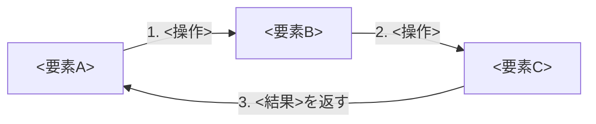
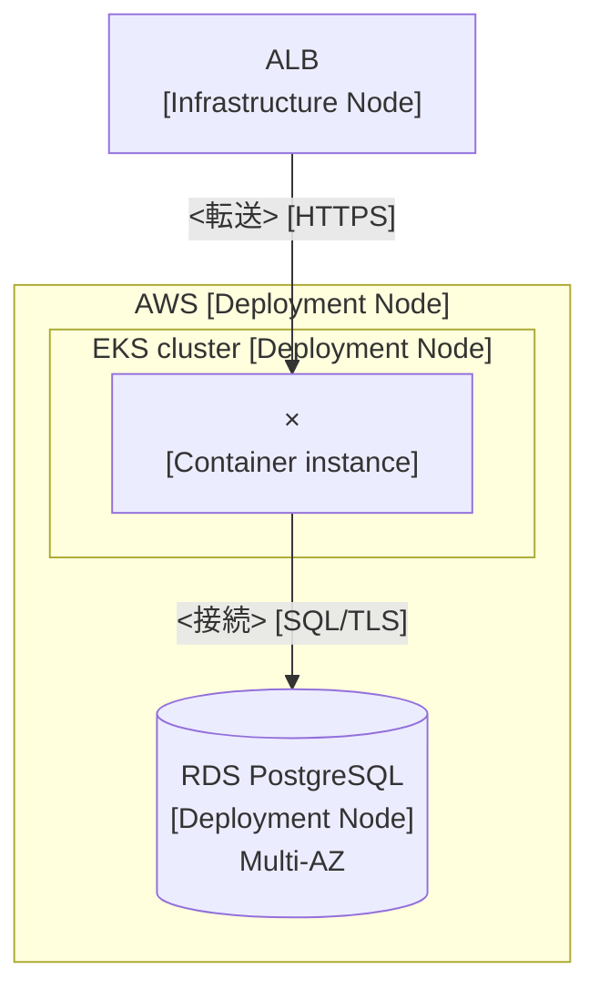

# C4 (architecture 図の house 規約)

出典: c4model.com。**arc42 の section 体系は採らない** — C4 の abstraction 体系と図の作法だけを採る。

## これだけ守る

1. 既定で書くのは **Landscape / Context / Container** の 3 枚。Component は価値がある container だけ。**Code は書かない** (IDE が生成できる。最速で腐る)
2. **level を混ぜない** — Container 図は container を、Component 図は 1 container の内部だけを描く。同じ要素を 2 つの level に貼らない
3. **Container 図に deployment を書かない** (冗長化 / LB / replica 数)。環境ごとの Deployment 図へ
4. **container = application または data store** (Docker ではない)。S3 bucket / RDS schema など managed でも自分が所有する範囲は container
5. **message bus を 1 箱にしない** — queue / topic を 1 本ずつ container として描く。簡略化するなら queue 名を矢印 label へ
6. **abstraction level を勝手に増やさない** — subsystem / bounded context / layer は grouping であって level ではない
7. **図の必須 6 要件**: title (種別 + 対象) / legend / 各要素に type と 1 行説明 / container・component に technology / 線は単方向で label 必須 / container 間の線に protocol
8. 線の label に `Uses` のような 1 語を使わない (「〜に検索要求を送る」のように具体化)
9. 大きくなったら 1 枚に詰めず、要素ごとに近傍 (inbound / outbound) だけの図へ分割する
10. C4 は**静的構造専用**。data model / state machine / business process は対象外 (DB schema は `docs/reference/`)

## 図の種別

| 図 | scope | 主要素 | 読者 | 既定で書くか |
|---|---|---|---|---|
| System Landscape | 組織 / portfolio | 複数 software system と人 | 技術・非技術 | ○ (platform には要る) |
| System Context | software system 1 つ | 対象 system + 利用者 + 外部 system | 全員 | ◎ |
| Container | software system 1 つ | 内部の application / data store | 技術者 | ◎ |
| Component | container 1 つ | 内部の component | 開発者 | △ 価値がある時のみ (生成推奨) |
| Code | component 1 つ | class / function | 開発者 | ✗ 書かない |
| Dynamic | feature / use case 1 つ | 協調する要素と番号付き相互作用 | 全員 | △ 複雑なものだけ |
| Deployment | 環境 1 つ | deployment node と instance | 技術者 | ○ 環境ごとに 1 枚 |

更新頻度は level が下がるほど高い。Context / Container は手書きで維持できる。Component 以下は生成を検討する。

## 落とし穴

| やりがち | なぜ壊れるか | 直し方 |
|---|---|---|
| message bus を 1 container にする | hub-and-spoke に見え、producer↔consumer の結合が隠れる | queue / topic 単位で container にする |
| Container 図に replica 数や LB を書く | 環境ごとに違うので即座に嘘になる | Deployment 図へ移す |
| Component 図に他 container の内部を描く | level 混在。読者が縮尺を見失う | 他 container は箱 1 つで表す |
| service 8 個を 1 枚に詰める | 線が交差して誰も読まない | service ごとに近傍だけの図に分割 |
| 「subsystem」level を足す | 定義が曖昧なまま増え、ad hoc 図に戻る | grouping (枠 / 色) で表現する |
| 図だけ貼って説明が無い | 図は単体で読めることが要件 | legend + 各要素の 1 行説明を足す |

## Mermaid 雛形

記法は自由 (C4 は notation independent) だが、既定は `flowchart` + `subgraph`。Mermaid の `C4Context` / `C4Container` は experimental でレイアウト制御が弱いため任意扱い。どちらでも必須 6 要件を満たす。

### System Context

````markdown


**凡例**: 👤 = Person / 角丸なし = Software System / 実線 = 同期呼び出し
````

### Container

````markdown


**凡例**: 角丸 = application container / 円筒 = data store container / [] 内 = 技術 / 矢印 label の [] = protocol
````

### Component (価値がある container のみ)

````markdown

````

### Dynamic (番号で順序を示す)

````markdown

````

sequence 表現が読みやすい場合は `sequenceDiagram` でもよい (同じ情報を別の形で示すだけ)。

### Deployment (環境ごとに 1 枚)

````markdown

````

### System Landscape

Context 図と同じ書式で、対象を 1 system に絞らず組織全体の system と人を並べる。IDP では platform 本体・onboard 済み system・外部 SaaS を 1 枚に置く。

## checklist

- [ ] title に図の種別と対象がある
- [ ] legend がある (形 / 色 / 線種の意味)
- [ ] 全要素に type (`[Person]` / `[Software System]` / `[Container: <技術>]` / `[Component]`) と 1 行説明がある
- [ ] 全ての線が単方向で label 付き。1 語 label が無い
- [ ] container 間の線に protocol がある
- [ ] level が混ざっていない / 同じ要素を 2 つの level に貼っていない
- [ ] Container 図に deployment 事情が入っていない
- [ ] message bus を 1 箱にしていない
- [ ] Code level を作っていない
- [ ] 略語が legend か本文で説明されている
