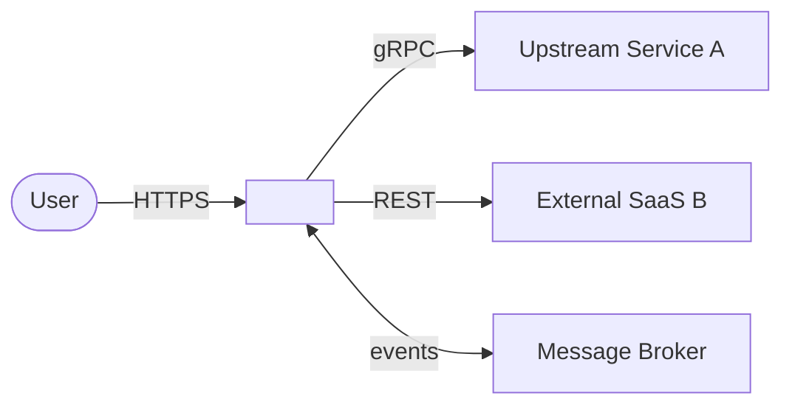
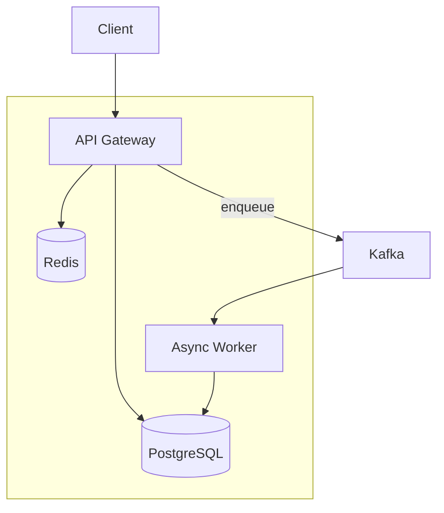
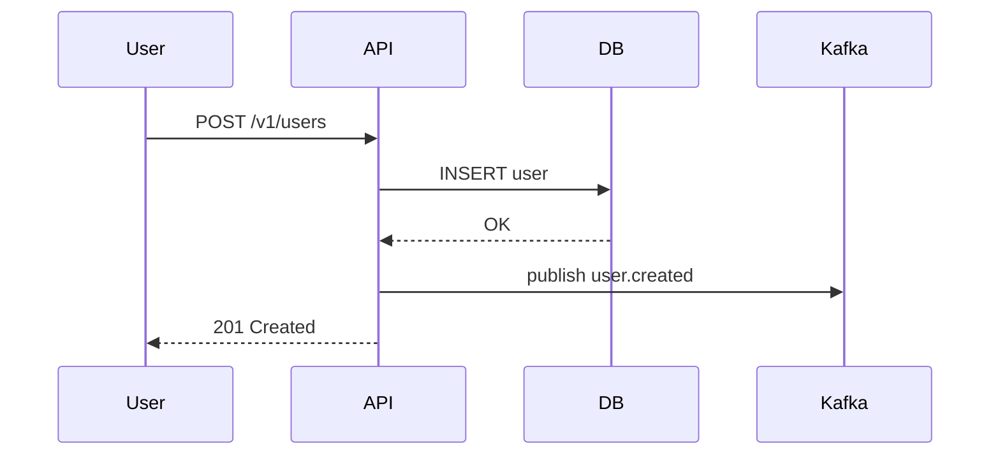
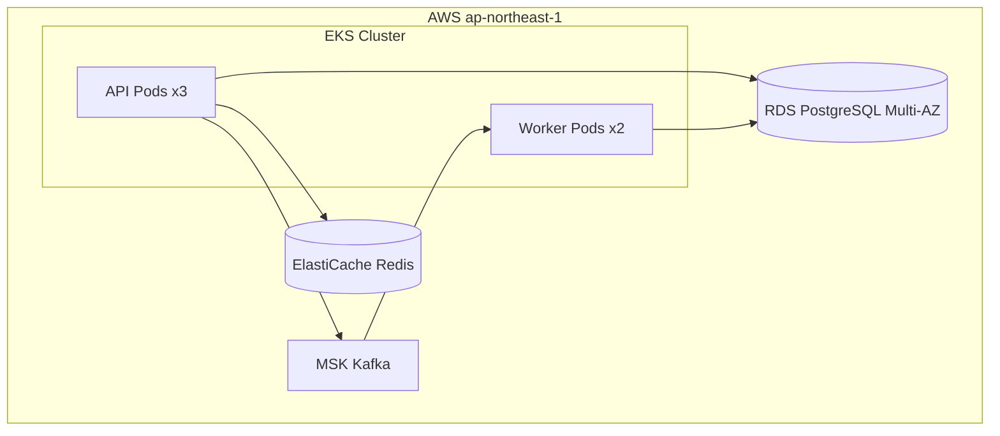

# システム設計ドキュメント (arc42 + C4 + MADR)

システム/サブシステム全体の設計を記述する。単一の意思決定を書く場合は ADR (`adr.md`) を使うこと。

デファクト組み合わせ:
- 骨格: arc42 (12セクションテンプレート)
- 図: C4 Model (Context/Container/Component/Deployment の4層)
- 意思決定: MADR (§9 に埋め込み or ADRファイルへのリンク)

## 必須ヒアリング項目

- システム名
- 目的 (解決する課題を1〜3文で)
- 主要ステークホルダー (開発チーム/運用/Biz/外部ユーザー)
- 主要な品質要件 (NFR) 3つ以上 — 測定可能な値で (例: P99レイテンシ100ms)
- 主要な制約 (既存インフラ/予算/期日/規制)
- 既に決まっている技術スタック (あれば)

品質要件が測定可能な値で出てこない場合は書き始めない。「高速」「安定」だけでは検証できない。

## テンプレート本文

```markdown
# <システム名> アーキテクチャ設計書

- **バージョン**: v0.1 (Draft) / v1.0 (Approved)
- **最終更新**: YYYY-MM-DD
- **オーナー**: <チーム名>
- **Status**: Draft / In Review / Approved / Superseded

## 1. Introduction and Goals (目的と目標)

### 1.1 背景・目的・目標

簡潔に。各項目1〜2文に収める。長文の説明は §3 や §4 に回す。

#### 背景(課題)

<現状の問題を事実ベースで1〜2文。例: バッチ集計が1時間遅延し、レコメンドの鮮度が要件を満たさない。>

#### 目的

<このシステムで達成することを1文。例: イベント発生からランキング反映までを数秒以内にする。>

#### 目標

測定可能な指標を3個まで。詳細は §10 品質要件へ。

1. <例: イベント投入→ランキング反映 P99 2秒以内>
2. <例: 99.95% 可用性>
3. <例: 10万イベント/秒までスケール>

### 1.2 主要品質目標 (Top 3-5)

| 優先順位 | 品質特性 | 具体的な目標値 |
|---------|---------|--------------|
| 1 | パフォーマンス | P99レイテンシ 100ms以下 |
| 2 | 可用性 | 99.9% (月次停止 43分以内) |
| 3 | 拡張性 | 書き込み 10k RPS まで水平拡張 |

### 1.3 ステークホルダー

| 役割 | 関心事 | 連絡先 |
|------|-------|--------|
| <例: AI基盤チーム> | 開発・運用オーナー | #team-ai-platform |
| <例: SRE> | 運用引き継ぎ | #sre |
| <例: Biz> | リリース時期 | <PdM名> |

## 2. Architecture Constraints (制約)

| 種類 | 制約 | 理由 |
|------|------|------|
| 技術 | Go 1.22+ で実装 | 既存スタックと統一 |
| 運用 | Kubernetesで稼働 | 既存基盤を利用 |
| 規制 | 個人情報を国外保存しない | 法務要件 |
| 予算 | <具体値> |  |

## 3. System Scope and Context (範囲とコンテキスト)

<C4 Level 1: System Context Diagram を Mermaid で>



### 3.1 対象(In Scope)

- <このシステムが責任を持つこと>

### 3.2 対象外(Out of Scope)

- <明示的に対象外のもの。あとで揉めがちな箇所>

### 3.3 外部インタフェース

| 相手 | プロトコル | 方向 | 備考 |
|------|----------|------|------|
| Upstream A | gRPC | Sys→A | 認証: mTLS |
| SaaS B | REST | Sys→B | Rate Limit 100 RPM |

## 4. Solution Strategy (解決方針)

<採用するパターンと技術選択の要約。詳細な決定は §9 へ。>

- **アーキテクチャパターン**: 例) イベント駆動 + CQRS
- **主要な技術選択**: 例) Go + gRPC + PostgreSQL + Kafka + Kubernetes
- **主要な設計原則**: 例) 書き込み経路はIdempotent / 読み取りはリードレプリカから

## 5. Building Block View (構成要素)

<C4 Level 2: Container Diagram を Mermaid で>



### 5.1 <Container A: API Gateway>

- **責務**: <1〜2文>
- **技術**: Go, gin
- **インタフェース**: REST `/v1/*`
- **依存**: PostgreSQL, Redis, Kafka

### 5.2 <Container B: Async Worker>

<同上>

### 5.3 Component View (必要な場合)

<C4 Level 3: 主要Containerの内部分解>

## 6. Runtime View (動的振る舞い)

<主要シナリオのシーケンス図。ハッピーパス + エラーパス 各1つ以上。>

### 6.1 <シナリオ: ユーザー登録>



### 6.2 <シナリオ: 障害時>

<例: upstreamタイムアウト時の振る舞い>

## 7. Deployment View (デプロイ)

<C4 Level 4: Deployment Diagram>



- **リージョン**: ap-northeast-1 (DR計画は §11)
- **インフラ**: EKS + RDS Multi-AZ + MSK
- **CI/CD**: GitHub Actions → ArgoCD

## 8. Crosscutting Concepts (横断的関心事)

### 8.1 認証・認可

<例: JWT + OAuth2 Authorization Code Flow>

### 8.2 ロギング・可観測性

<例: OpenTelemetry → Grafana Stack (Loki/Tempo/Prometheus)>

### 8.3 エラーハンドリング

<例: 共通エラー型、リトライポリシー、回路遮断>

### 8.4 データ整合性

<例: Outbox Pattern で DB↔Kafka を atomic に>

### 8.5 セキュリティ

<例: 機密は AWS Secrets Manager、コードには埋め込まない>

## 9. Architecture Decisions (意思決定ログ)

本システムに関連する重要な設計判断は ADR として別管理:

| ADR | タイトル | Status |
|-----|---------|--------|
| [ADR-0005](../adr/0005-adopt-cqrs.md) | CQRSパターンの採用 | Accepted |
| [ADR-0012](../adr/0012-adopt-vald-for-vector-search.md) | ベクトル検索にValdを採用 | Accepted |

<新しい決定が必要になったら、このシステム設計書を更新する前に ADR を追加すること。>

## 10. Quality Requirements (品質要件)

品質シナリオ形式で**測定可能な形**で記述する。

### 10.1 パフォーマンス

| シナリオID | 刺激 | 環境 | 応答 | 応答尺度 |
|-----------|-----|------|------|---------|
| P-1 | クライアントがAPIを呼ぶ | 通常負荷 (1000 RPS) | 応答を返す | P99 100ms以下 |
| P-2 | 同上 | ピーク負荷 (5000 RPS) | 応答を返す | P99 300ms以下 |

### 10.2 可用性

| シナリオID | 刺激 | 環境 | 応答 | 応答尺度 |
|-----------|-----|------|------|---------|
| A-1 | 1台のPodが停止 | 本番運用中 | サービス継続 | エラー率1%未満 |
| A-2 | AZが1つ停止 | 本番運用中 | サービス継続 | 30秒以内にfailover |

### 10.3 スケーラビリティ / セキュリティ / その他

<以下同様に>

## 11. Risks and Technical Debt (リスクと技術的負債)

| ID | 種類 | 内容 | 影響 | 対処方針 |
|----|------|------|------|---------|
| R-1 | リスク | 外部SaaSの依存(B) | SaaS障害でサービス停止 | §8.3のCircuit Breakerで部分縮退 |
| D-1 | 技術的負債 | 旧認証基盤をv0で残す | 2系統運用 | v1.3で廃止予定 |

## 12. Glossary (用語集)

| 用語 | 定義 |
|------|------|
| <用語A> | <ドメイン固有の定義> |
```

## 書き方のコツ

1. §10 品質要件は必ず測定可能な値で書く。「十分なパフォーマンス」は品質要件ではない。シナリオID (P-1, A-1) を振って、後から SLO/SLI と紐付けられるようにする。
2. §9 は ADR へのリンク集に徹する。ここで設計を議論しない。議論は別ADRで。
3. 図は C4 の粒度を守る。Container図にクラス名を書かない(Component/Code図の仕事)。Mermaidなら `flowchart` と `sequenceDiagram` を使い分ける。
4. §5 Building Block View は階層を守る。Level 2(Container) → Level 3(Component) の順。いきなりクラス図から始めない。
5. Draft → In Review → Approved の Status 遷移を明記し、レビュー前/後を区別する。

## ADRとの棲み分け

| 書きたいもの | どこに |
|-------------|--------|
| 「なぜ X を選んだか」 (単一の決定) | ADR (`docs/adr/NNNN-...md`) |
| 「このシステム全体がどう動くか」 | システム設計書 (このテンプレ) |
| 「システム設計書に影響する新しい決定」 | まず ADR を書き、§9 にリンクして設計書を更新 |

## 保存先

- `docs/design/<system-name>.md`
- サブシステムがあれば `docs/design/<system-name>/<subsystem>.md`

## 参考

- arc42 公式: https://arc42.org/
- arc42 テンプレート: https://github.com/arc42/arc42-template
- C4 Model: https://c4model.com/
- MADR: https://adr.github.io/madr/
