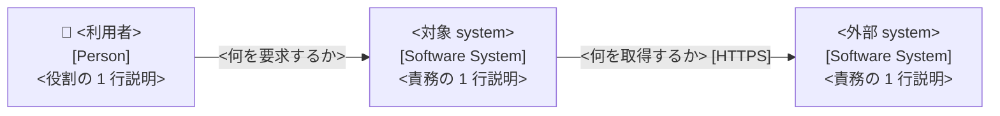
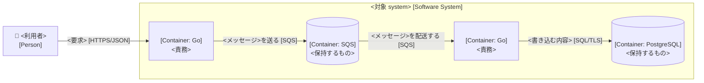
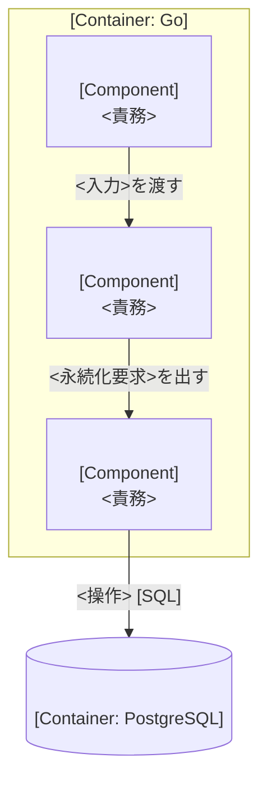
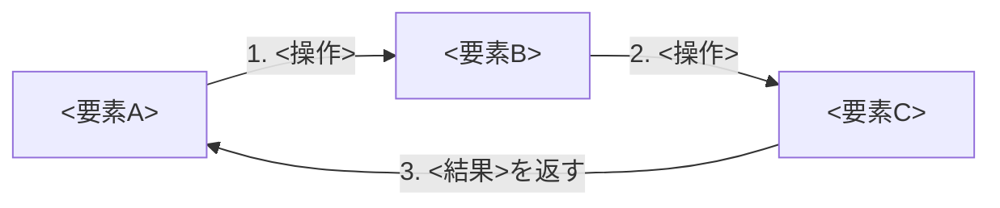
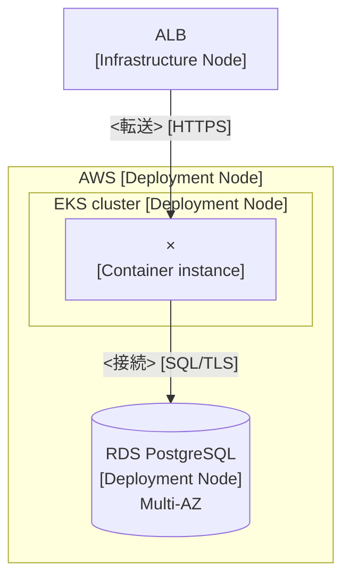

# C4 (house conventions for architecture diagrams)

Source: c4model.com. **arc42's section system is not adopted** — only C4's abstraction system and diagram conventions are.

## Just follow these

1. By default draw three: **Landscape / Context / Container**. Component only for containers where it adds value. **Do not draw Code** (an IDE can generate it; it rots fastest)
2. **Don't mix levels** — a Container diagram draws containers, a Component diagram draws the inside of exactly one container. Never place the same element at two levels
3. **Don't put deployment into the Container diagram** (redundancy / LB / replica counts). Those go to the per-environment Deployment diagram
4. **A container is an application or a data store** (not Docker). An S3 bucket / RDS schema is a container too when it's yours, even if managed
5. **Don't draw the message bus as one box** — draw each queue / topic as its own container. To simplify, move the queue name onto the arrow label
6. **Don't invent extra abstraction levels** — subsystem / bounded context / layer are groupings, not levels
7. **Six required elements of a diagram**: title (type + scope) / legend / a type and a one-line description on every element / technology on every container and component / unidirectional labelled lines / protocol on inter-container lines
8. Never label a line with a single word like `Uses` (make it concrete: 「〜に検索要求を送る」)
9. When it grows, don't cram one diagram — split into per-element diagrams showing only the nearest inbound / outbound neighbours
10. C4 is **for static structure only**. Data models / state machines / business processes are out of scope (DB schema goes to `docs/reference/`)

## Diagram types

| Diagram | Scope | Primary elements | Reader | Draw by default? |
|---|---|---|---|---|
| System Landscape | Organisation / portfolio | Multiple software systems and people | Technical and non-technical | ○ (a platform needs it) |
| System Context | One software system | The system + users + external systems | Everybody | ◎ |
| Container | One software system | Applications / data stores inside | Technical people | ◎ |
| Component | One container | The components inside | Developers | △ Only when it adds value (generation recommended) |
| Code | One component | Classes / functions | Developers | ✗ Don't draw |
| Dynamic | One feature / use case | Collaborating elements with numbered interactions | Everybody | △ Complex ones only |
| Deployment | One environment | Deployment nodes and instances | Technical people | ○ One per environment |

The lower the level, the faster it changes. Context / Container can be maintained by hand. Consider generating Component and below.

## Pitfalls

| Tempting move | Why it breaks | Fix |
|---|---|---|
| Drawing the message bus as one container | It looks hub-and-spoke and hides the producer↔consumer coupling | Make each queue / topic a container |
| Putting replica counts and LBs in the Container diagram | They differ per environment, so it's a lie immediately | Move to the Deployment diagram |
| Drawing another container's internals in a Component diagram | Mixed levels. The reader loses the scale | Represent other containers as a single box |
| Cramming 8 services into one diagram | Crossing lines, nobody reads it | Split into per-service neighbourhood diagrams |
| Adding a "subsystem" level | It grows while the definition stays vague, and you're back to ad hoc diagrams | Express it as a grouping (box / colour) |
| Pasting a diagram with no description | A diagram must stand alone | Add the legend and one-line descriptions |

## Mermaid skeletons

Notation is free (C4 is notation independent), but the default is `flowchart` + `subgraph`. Mermaid's `C4Context` / `C4Container` are experimental with weak layout control, so they are optional. Either way, satisfy the six required elements.

### System Context

````markdown


**凡例**: 👤 = Person / 角丸なし = Software System / 実線 = 同期呼び出し
````

### Container

````markdown


**凡例**: 角丸 = application container / 円筒 = data store container / [] 内 = 技術 / 矢印 label の [] = protocol
````

### Component (only for containers where it adds value)

````markdown

````

### Dynamic (numbers show the ordering)

````markdown

````

Use `sequenceDiagram` instead when a sequence reads better (it's the same information in a different form).

### Deployment (one per environment)

````markdown

````

### System Landscape

Same format as the Context diagram, but instead of narrowing to one system, lay out the organisation's systems and people. For an IDP, put the platform itself, the onboarded systems, and external SaaS on one sheet.

## checklist

- [ ] The title carries the diagram type and its scope
- [ ] A legend exists (meaning of shapes / colours / line styles)
- [ ] Every element has a type (`[Person]` / `[Software System]` / `[Container: <技術>]` / `[Component]`) and a one-line description
- [ ] Every line is unidirectional and labelled. No single-word labels
- [ ] Inter-container lines carry the protocol
- [ ] Levels are not mixed / no element appears at two levels
- [ ] No deployment concerns in the Container diagram
- [ ] The message bus is not a single box
- [ ] No Code-level diagram was created
- [ ] Acronyms are explained in the legend or the body
